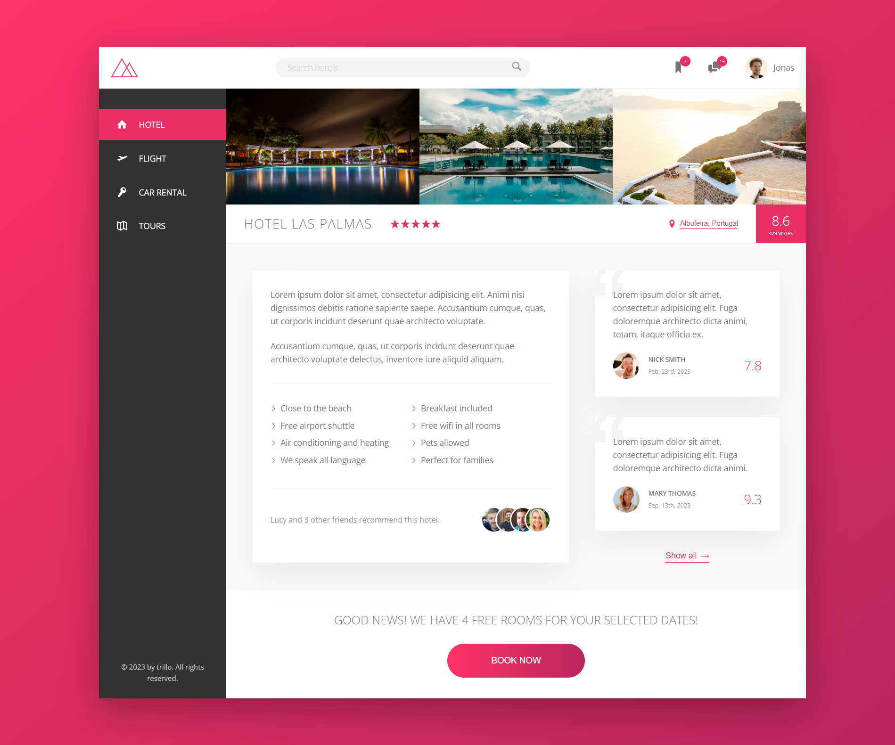

# Trillo Project

Trillo is your ultimate all-in-one booking app designed to simplify your travel and accommodation plans. Whether you're planning a vacation, business trip, or weekend getaway, Trillo streamlines the booking process, providing a seamless experience from start to finish.

## Table of contents

- [Overview](#overview)
  - [The challenge](#the-challenge)
  - [Screenshot](#screenshot)
  - [Links](#links)
- [My process](#my-process)
  - [Built with](#built-with)
- [Author](#author)
- [Acknowledgments](#acknowledgments)

## Overview

### The challenge

Users should be able to:

- See and experience modern website design

### Screenshot

### Links

- Live Site URL: [https://quiel-trillo.netlify.app/](https://quiel-trillo.netlify.app/)

## My process

### Built with

- HTML5
- CSS3
- Sass

## Author

- GitHub - [quielLovesLasagna](https://github.com/quielLovesLasagna)

## Acknowledgments

I would like to thank [Jonas Schmedtmann](https://twitter.com/jonasschmedtman) and his team for teaching and helping me and everyone else throughout the course.
